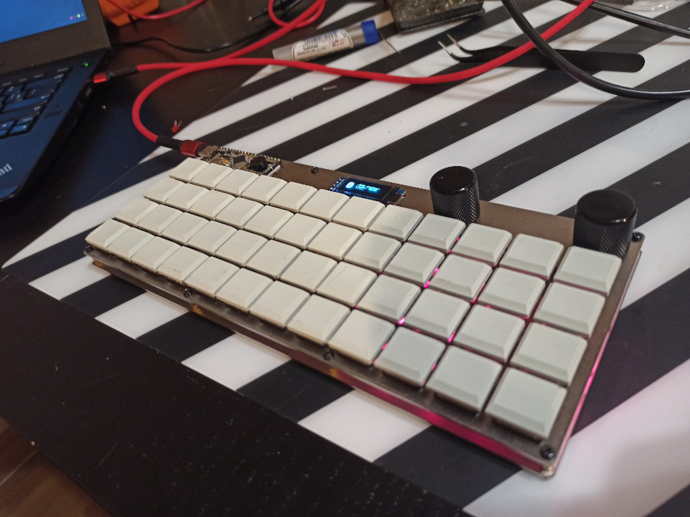

D48
===

A Proton C based handwired 48 key keyboard with 2 rotary encoders, I2C OLED & WS2812 strip.

- Keyboard Maintainer: Andrew Dunai
- Hardware Supported: Proton C handwired

Make example for this keyboard (after setting up your build environment):

    make d48:anderson:dfu-util

Pinout:

