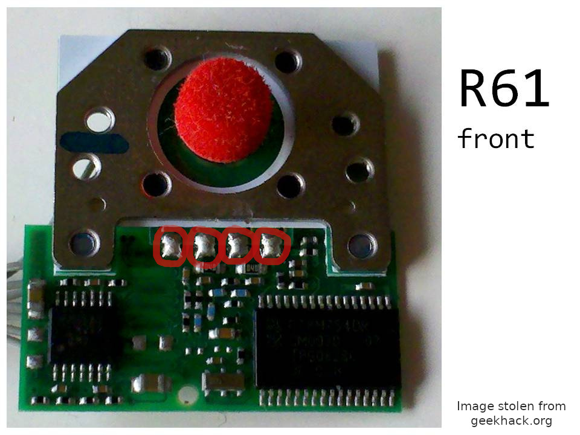
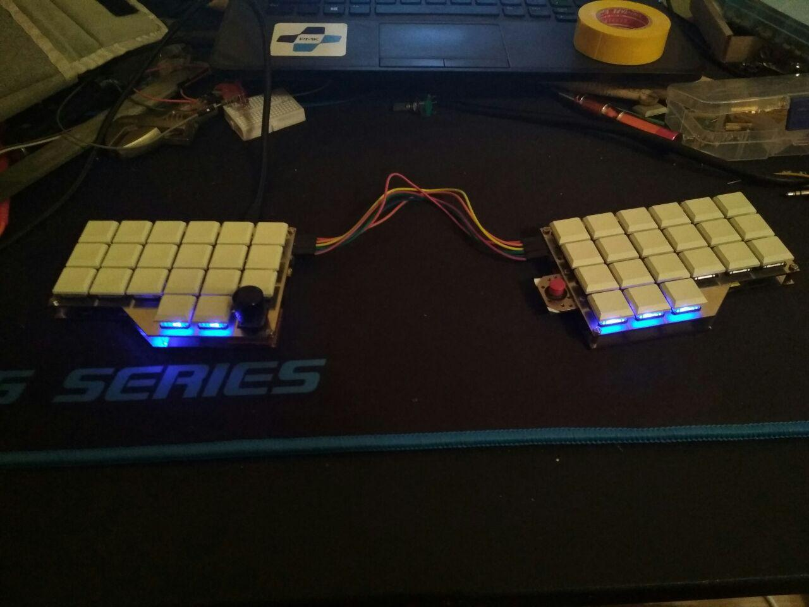
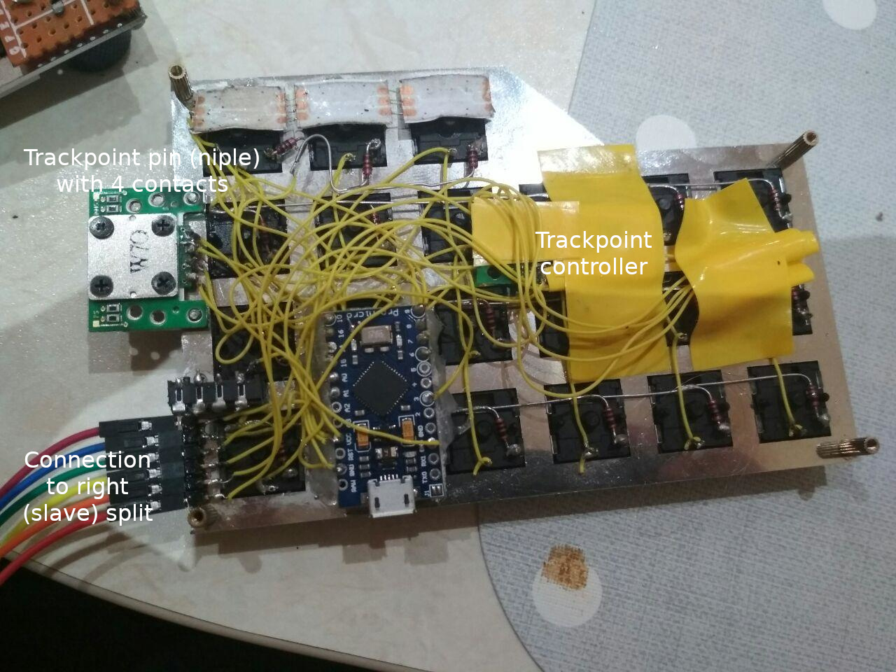
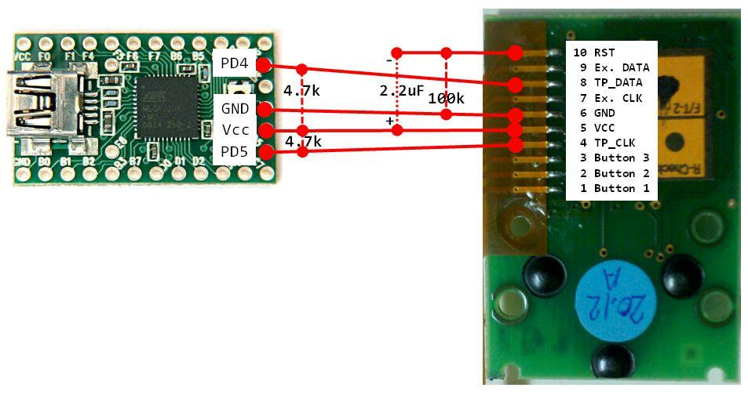

# Let's Split with a Trackpoint build log

Okay, so I've got a handwired Let's Split keyboard with a rotary encoder what next? Let's install a good old trackpoint!

# Prerequisites

Please refer to [this great article here](https://github.com/alonswartz/trackpoint) for some basic info about installing trackpoints onto QMK-compatible boards.


I'll be referencing the above article in my log.

# Hardware

I've got mine from a Lenovo ThinkPad R61 keyboard. I easily found a bunch of old ones on the internet.
The great thing is that you can easily detach them from a keyboard! This makes it even easier to mount them.

Once you've got your trackpoint, refer to [this article](https://deskthority.net/wiki/TrackPoint_Hardware) to figure out the wiring.

I've identified mine as **R61** (marking on the back may differ - W7O, W8P etc).


Note: Pin 7 is actually in the same row as all the rest, my guess is that the image above contains a trackpoint with its ground pin damaged,
so the author had to solder it in a different place.

The wires we'll need at the moment are VCC (8), GND (7), CLOCK (6) and DATA (1).

Also border width of my keyboard won't let me mount my trackpoint on the side, so we'll decouple the trackpoint into two parts
by desoldering the pins circled in red and replacing them with wires:



This will let us keep the controller away from trackpoint in a more convenient place.

# Determining the wiring

From now on we assume that the master is always a left split and a slave is always a right one (I use it that way).

So I have a Let's Split with a TRRS cable. I use all 4 pins:

- GND & VCC - to supply power to the slave (right) side;
- DATA - to read key presses & releases from the slave (right) side;
- LED DATA - to control underglow of the ws2812b LEDs on the slave (right) side.

Because I want my trackpoint on the right split and I want to always use left split as master (doing it the hard way!), I'll need to somehow deliver trackpoint
readings to the master (left) split.

To function properly, our trackpoint needs 4 wires: GND, VCC, CLOCK and DATA. We already have GND & VCC delivered via a TRRS cable so we can reuse them. But what about CLOCK & DATA?

Of course we can generate CLOCK signal on the right split, but it won't be synchronized with the left one so this method will be very error-prone and hard to debug.

To be sure that the stuff is wired as QMK expects us to, we'll need to connect CLOCK and DATA to the Pro Micro on the left (master) side. To do this, I've found it easiest
to ditch TRRS (and its shitty connectors) in favor of a colorful jumper wires connection. More colors to this world!

So the wires that connect the halves are:

- GND
- VCC
- DATA for QMK key sync
- DATA for LED underglow
- CLOCK for trackpoint
- DATA for trackpoint



Here's what I've ended up with:

## Left (master) split

Left (master) split contains Pro Micro, 6-wire socket to communicate with a right part and a rotary encoder.

You can also see 4.7 kOhm resistors between VCC and CLOCK & DATA pins - this is my incomplete reset circuit (see @alonswartz tutorial in the beginning of this article).

Also keep in mind that you'll need to solder CLOCK wire to PD5 port on Pro Micro which is occupied by a TX led (circled in red.)

Here's my spaghetti board:


## Right (master) split

Here's my other spaghetti board:



# Software

I've used USART method (best) because I connected to pins RX & 22. See link to by @alonswartz tutorial in the beginning of this artiche.

# Known issues

Because I haven't got any 2.2 uF capacitors around, I didn't finish my reset circuit which leads to trackpoint being correctly initialized
in around 20% cases. In other 80% cases it just jumps chaotically around the screen hitting random buttons. Gonna fix that on Monday!

Here's what a recet circuit should look like:

# Trackpoint orientation

I had to patch `tmk_core/protocol/ps2_mouse.c` (line 179) to rotate my trackpoint readings by 90 degrees CW (my trackpoint was mounted rotated by 90 degrees CCW):

```
+    int x, y;
+    x = mouse_report->x;
+    y = mouse_report->y;
+    mouse_report->x = y;
+    mouse_report->y = -x;
```

# FAQ

Q: Why didn't you connect all 4 trackpoint pins to the slave Pro Micro?

Because slave part only reports key presses & releases to the master. It won't be able to properly deliver trackpoint mouse control signals to the PC.

Q: Why didn't you simply use the right half as master and avoid all the headache with adding extra 2 wires to connect the halves?

Because I use rotary encoder on the left (master) part and connecting in right part to the PC instead of the left would break the encoder that's located on the left part. :v

Q: How did you connect to pin D22 (port PD5) and what's so special about it?

There are 2 "hidden" pins in the Pro Micro: 8 (port PB0, connected to RX LED) and 22 (port PD5, connected to TX LED). You can connect to them
by soldering a wire on the lower leg of the resistors located below the RX/TX leds (if you hold your Pro Micro with its USB socket up).

Pin 22 is "special" because, IIRC, it can generate proper CLOCK signal in conjuction with RX pin.



I hope it was helpful. If not - sorry. I've tried to be verbose. Unfortunately I didn't take much photos during assembly.
If you have any questions - let me know: a.dun@ai or /u/andunai.
